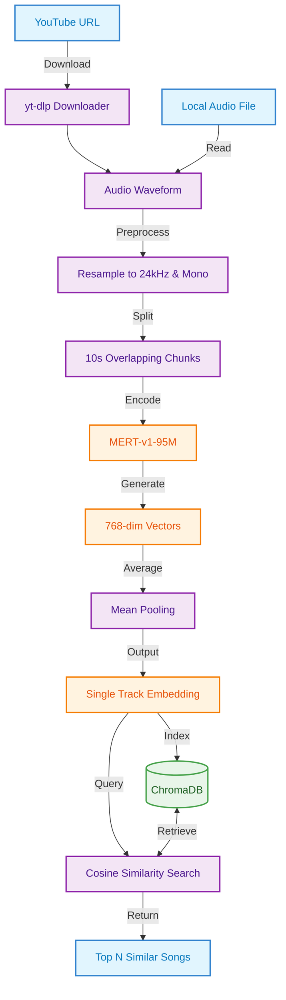

# MusicDB: SOTA Music Similarity Search

MusicDB is a modern music similarity search system using State-of-the-Art (SOTA) **MERT-v1-95M** embeddings and a local **ChromaDB** vector store. 

The system provides a clean CLI to download music from YouTube, generate rich audio embeddings with smart chunking, and perform fast similarity searches against a local database.

## 🚀 Key Features

- **MERT Embeddings:** Uses the [MERT-v1-95M](https://huggingface.co/m-a-p/MERT-v1-95M) model for superior acoustic music understanding.
- **Local Vector DB:** Powered by **ChromaDB** for fast, local persistence without external cloud dependencies.
- **Async Pipeline:** Concurrent YouTube downloads with `yt-dlp` and `curl-cffi` for high performance and bot-protection bypass.
- **Smart Chunking:** Automatically splits long audio into overlapping segments (10s) and pools them into a single track-level embedding.
- **Modern Stack:** Built with `uv`, `Pydantic v2`, `Loguru`, and `Click`.

## 📁 Project Structure

```
MusicDB/
├── core/                    # Core abstractions & configuration
│   ├── config.py            # Pydantic settings & environment loading
│   └── exceptions.py        # Custom structured error handling
├── services/                # Business logic layer
│   ├── chroma_service.py    # Local Vector Database management
│   ├── mert_service.py      # Embedding generation & chunking logic
│   ├── audio_service.py     # Librosa-based preprocessing
│   └── youtube_service.py   # Async yt-dlp downloader
├── musicdb_cli.py           # Main Unified CLI
├── music_pipeline.py        # E2E Download + Embed + Index pipeline
├── query_database.py        # Search & retrieval logic
├── add_music_embeddings.py   # Script for indexing local audio files
├── utils.py                 # Common utility functions
├── pyproject.toml           # UV project configuration
└── .env                     # Environment variables
```

## 🛠️ Installation

1. **Install uv:**
   ```bash
   curl -LsSf https://astral.sh/uv/install.sh | sh
   ```

2. **Clone and Setup:**
   ```bash
   git clone https://github.com/yourusername/MusicDB.git
   cd MusicDB
   uv sync
   ```

3. **Configure Environment:**
   Create a `.env` file (see template below) or run the CLI to generate defaults.

## 💻 Usage

The system is managed entirely through the `musicdb_cli.py`.

### 1. Download and Index from YouTube
```bash
# Process a single video
uv run python musicdb_cli.py download video "https://www.youtube.com/watch?v=..."

# Process an entire playlist (concurrent downloads)
uv run python musicdb_cli.py download playlist "https://www.youtube.com/playlist?list=..."
```

### 2. Process Local Files
```bash
# Scan a directory and add all audio files to the database
uv run python musicdb_cli.py process directory ./my_music
```

### 3. Search for Similar Songs
```bash
# Find songs in your DB that sound like your local audio file
uv run python musicdb_cli.py search audio ./query_song.mp3
```

### 4. Database Management
```bash
# Show collection stats
uv run python musicdb_cli.py db stats

# List songs in the database
uv run python musicdb_cli.py db list
```

## ⚙️ Configuration

Settings can be managed via the `.env` file:

```ini
# ChromaDB Settings
CHROMA_DB_PATH=./chroma_data
CHROMA_DB_COLLECTION_NAME=song_vector_collection

# MERT Model Settings
MERT_MODEL_NAME=m-a-p/MERT-v1-95M
MERT_SAMPLE_RATE=24000

# Processing Settings
MUSICDB_ENABLE_GPU=true
AUDIO_CHUNK_DURATION=10
AUDIO_CHUNK_OVERLAP=2
```

## 🔄 Data Flow



## ⚖️ License

MIT
